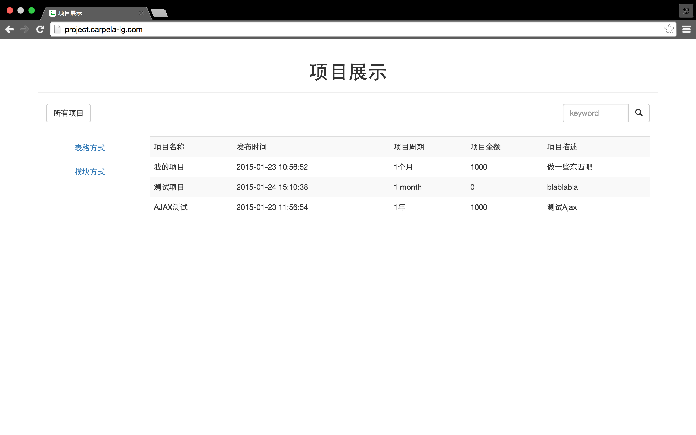
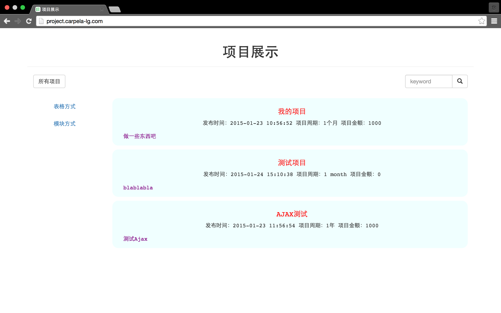
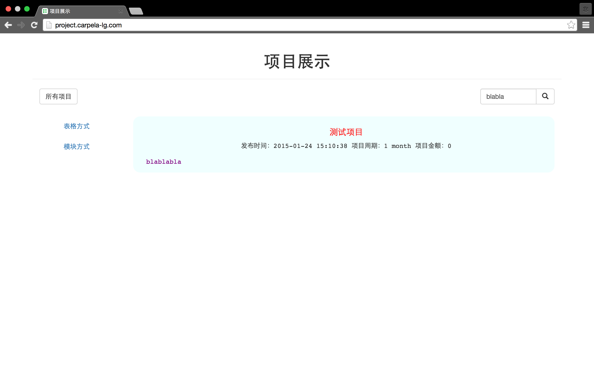
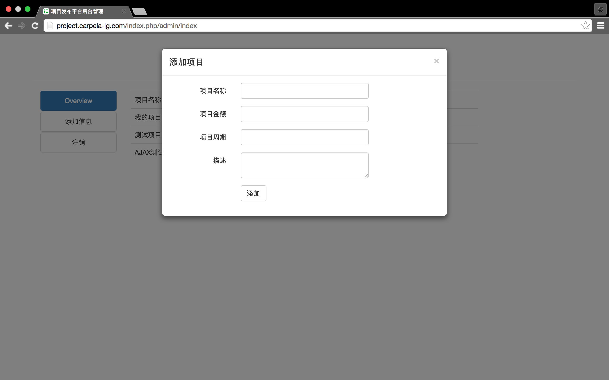
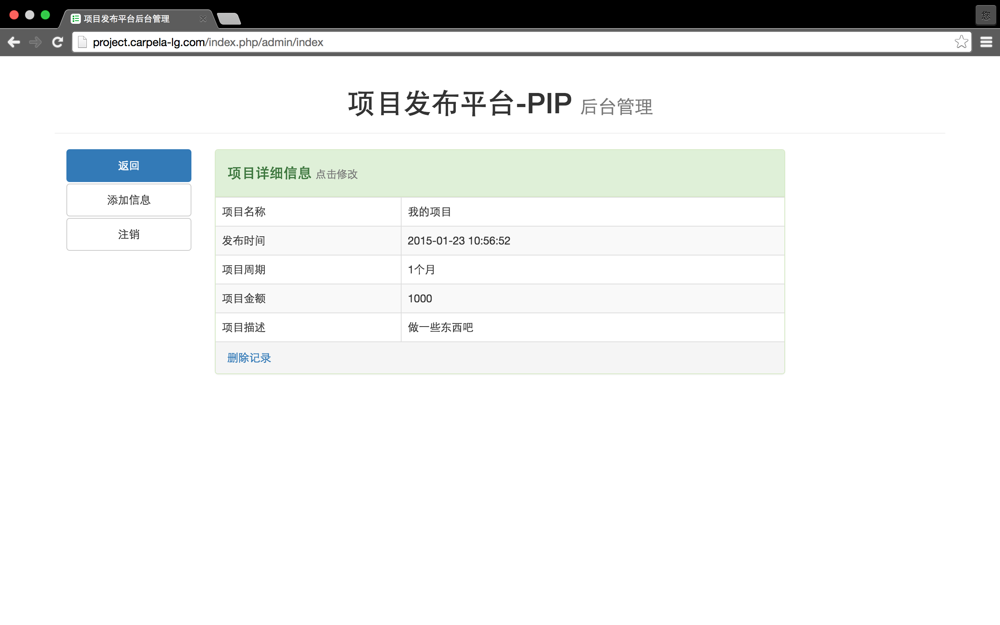
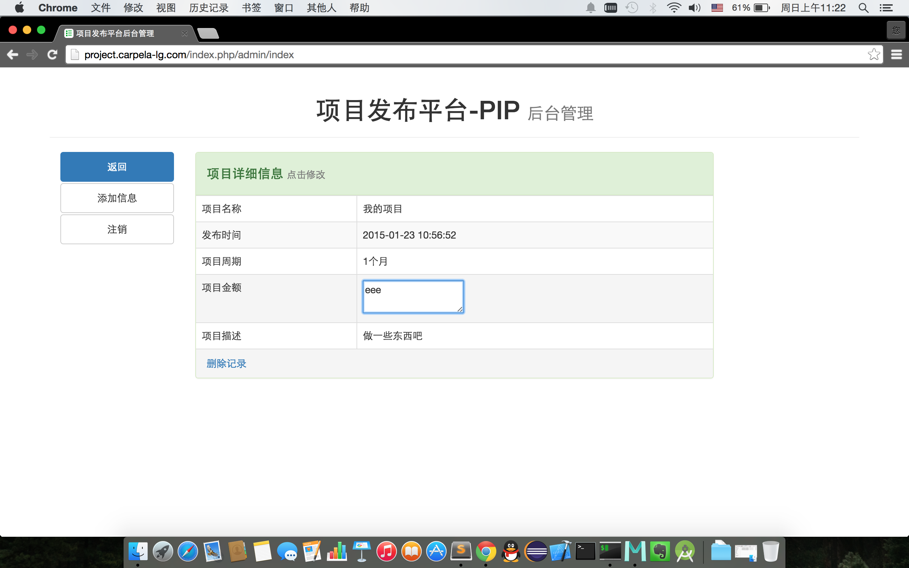
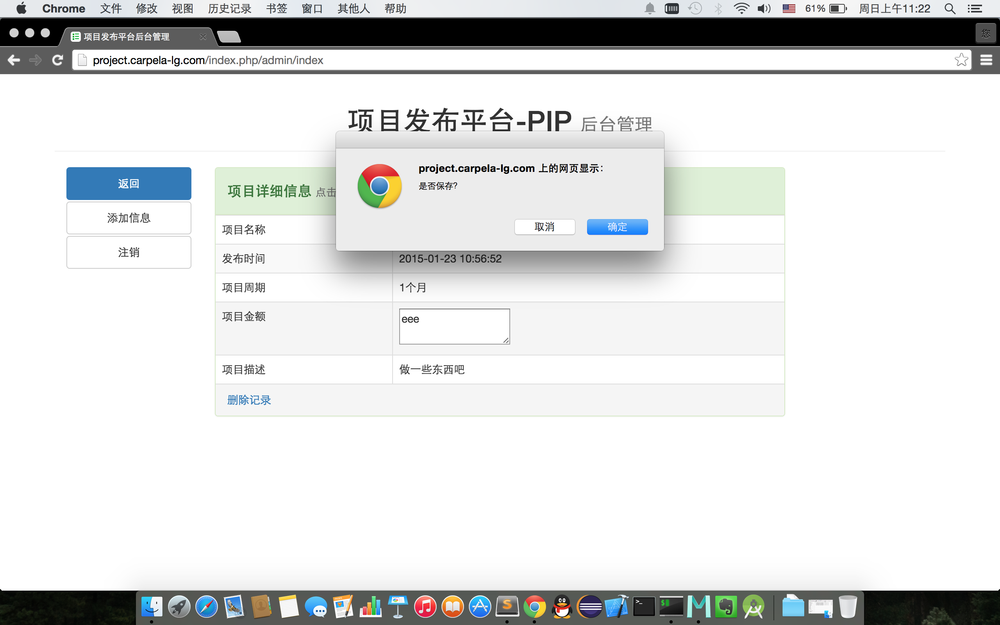

#项目发布平台
---

##简介

使用CodeIgniter和MySQL搭建的简单项目发布平台。数据库定义见projects.sql，导出的测试数据在data.sql（数据库名：project_issue）。

前台界面`<base_url()>`	后台登录`<base_url()>/index.php/admin/index`

##展示页面

表格方式

模块方式

搜索模块

##后台管理

登录

总览

添加

详细信息

修改

失去焦点
